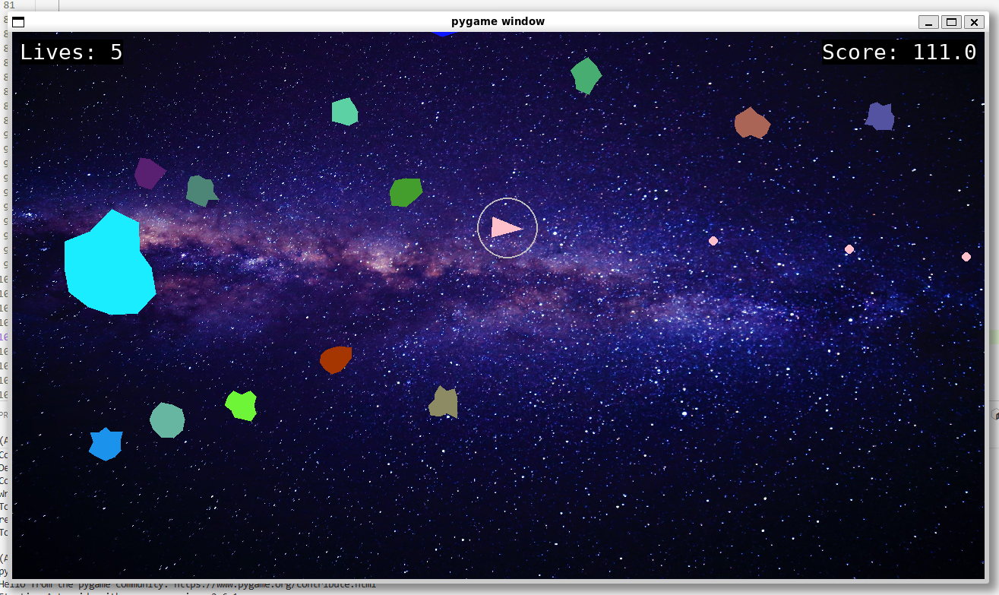

# Asteroids 

## [🇧🇷]  Sobre o Projeto

Projeto desenvolvido como parte da trilha de desenvolvimento da plataforma Boot.dev. A implementação foi expandida além da proposta original, incorporando melhorias estruturais, ajustes na lógica de jogo e aprimoramentos visuais.

## Principais Modificações e Melhorias

**Reestruturação do modelo dos asteroides**: substituição da representação circular simples por polígonos com variação angular e offsets randômicos, resultando em formas mais orgânicas e visualmente dinâmicas.

**Renderização com preenchimento sólido dos asteroides**, aprimorando a legibilidade visual e o contraste em tela.

**Sistema de cores dinâmico:** geração aleatória de cores para cada asteroide no momento da instânciação, aumentando a variabilidade estética da gameplay.

**Customização do background**, proporcionando melhor ambientação visual.

**Sistema de pontuação escalável:** cálculo de score proporcional ao tamanho do asteroide destruído, incentivando estratégia de risco versus recompensa.

**Implementação de escudo protetor:** ativado automaticamente a cada múltiplo de pontuação definido, absorvendo um impacto antes de ser desativado.

**Sistema de vidas:** controle explícito de estados do jogador, permitindo múltiplas colisões antes do encerramento da partida.

**Ajuste na física de borda:** os asteroides passaram a utilizar detecção de colisão com os limites da tela, invertendo o vetor de velocidade ao atingir as bordas, eliminando a saída permanente do campo visível.

## [🇺🇸] About the Project

This project was developed as part of the Boot.dev development track. The implementation extends beyond the original proposal by incorporating structural improvements, gameplay logic enhancements, and visual refinements.

## Key Modifications and Enhancements

**Asteroid shape redesign:** replaced the basic circular representation with procedurally generated polygons using angular distribution and randomized radial offsets, resulting in more organic and dynamic shapes.

**Solid-fill rendering of asteroids,** improving on-screen visibility and visual clarity.

**Dynamic color system:** each asteroid is assigned a randomized color at instantiation, increasing gameplay variety.

**Background customization** to enhance overall visual atmosphere.

**Scalable scoring system:** score calculation is proportional to asteroid size, introducing a risk–reward dynamic.

**Protective shield mechanic:** automatically activated at defined score thresholds, absorbing a single collision before being deactivated.

**Life management system:** explicit player state control allowing multiple hits before triggering game over.

**Boundary collision physics update:** asteroids now detect screen edge collisions and invert their velocity vectors upon impact, preventing them from permanently leaving the visible play area.

